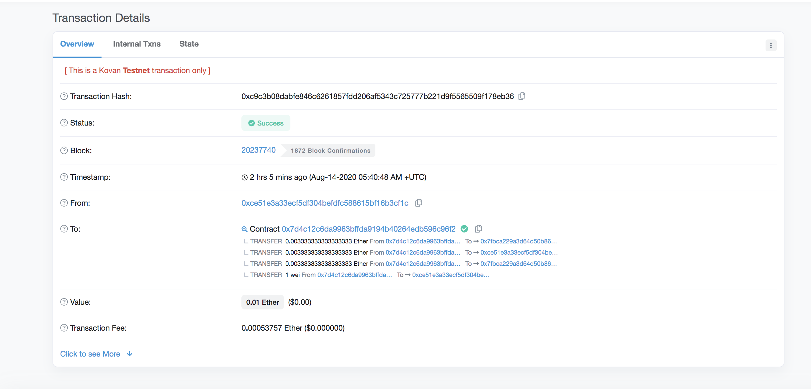

# Solidity
### Associate Profit Splitter:

The AssociateProfitSplitter contract allows the Human Resources department to pay employees quickly and efficiently by splitting a payment evenly among three employees. 

We created "constructor function" to enter three account addresses when deploying. Also, In order to avoid hardcoding the employee addresses we set the employee addresses to equal the parameter values within the constructor. 

Sending address:
0xce51e3a33ecf5df304befdfc588615bf16b3cf1c

Contract address:
0x7d4c12c6da9963bffda9194b40264edb596c96f2

Transaction hash: 0x71d55b1e0d1124ad0b85080080b4728cf5a365a22a5ef20da12af165647f0e6e

Etherscan link:
https://kovan.etherscan.io/tx/0xc9c3b08dabfe846c6261857fdd206af5343c725777b221d9f5565509f178eb36

